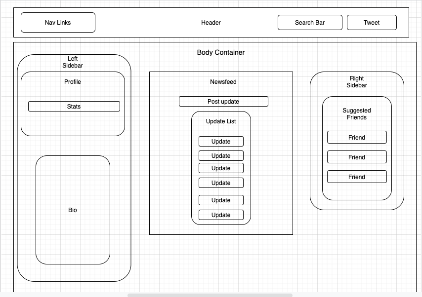

# Social Media 

#### A React application - Epicodus, 09.08.2020

## By Mariel Hamson, Brittany Lindgren, Hannah Beinstein, and Sara Kane

## Description

A basic React app to practice building out components.

## Project WireFrame / Component Diagram

## Setup/Installation Requirements

| Steps | Example |
| -------- | ----- |

<!-- // if using package.json / npm, make sure to include the direction below in the setup instructions
clone the project and then run the command npm install -->

#### Additional Setup/Installation Notes:

* You do not need to run a server to view this document.

* No additional code is necessary to view this project.   

## Specifications

| Behavior | Input | Output |  Completed(Y/N?)  |
| -------- | ----- | ------ | -------- |
|    |   |    |    |

## Known Bugs

| Location (html/css/js & specific location if known) |  Message  | Bug | Resolved (Y/N) |  How was the issue resolved?  |
| ------- | ----- | ------ | ------ | --------- |
|  |  |  |  |  |

## Support and contact details

Please feel free to contact us through GitHub (username: LINDGRENBA, username: MARIELHAMSON, username: HBEINSTEIN, username: SARAKANE) with any questions, ideas or concerns.  

## Technologies Used

* HTML5
* CSS3
* Javascript/JSX
* React
* Visual Studio Code 
* Git and Git BASH 

### License

*This site is licensed under the MIT license.*

Copyright (c) 2020 **_Brittany A Lindgren, Mariel Hamson, Hannah Beinstein, and Sara Kane_**